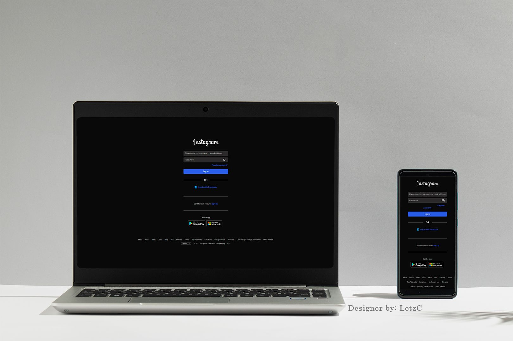

- [Overview - English](#overview)

# Visão Geral

Redesign da página de login do Instagram na versão web.

## Aprendizado
Projeto que fiz de um redesign da página de login web do Instagram. A inspiração das cores veio da versão mobile do aplicativo. Alguns dos pontos que mais aprendi e aprimorei nesse projeto foram:
* **Responsividade:** Fiz desde a versão web pensando na responsividade geral, o que fez com que eu não precisasse tanto do uso de media query para torná-la responsiva.
* **Posicionamento de elementos:** Utilizei bastante o flex e visualizei os elementos mentalmente como caixas, o que facilitou o posicionamento.
* **Funcionalidade de ocultar a senha:** Foi mais simples do que eu imaginava, e pretendo aplicar mais interações nos próximos projetos.

## Futuras Melhorias
Pretendo usar esse projeto para aprender a fazer uma versão em outro idioma. E pode haver a possibilidade de continuar com um projeto com mais páginas do Instagram. Foi uma experiência muito divertida :)

## 🛠️ Tecnologias usadas:
- 
- 
- 

  

# Overview

### Apprenticeship
Project I did for a redesign of the Instagram web login page. The color inspiration came from the mobile version of the app. Some of the key things I learned and enhanced in this project were:
* **Responsiveness:** I designed the web version with overall responsiveness in mind, which reduced the need to use media query to make it responsive.
* **Element positioning:** I made extensive use of flex and visualized the elements as boxes in my mind, which made positioning them much easier.
* **Password hiding functionality:** It was simpler than I had imagined, and I plan to incorporate more interactions in future projects.

### Future Enhancements
I plan to use this project to learn how to create a version in another language. There's also the possibility of continuing with a project that includes more Instagram pages. This experience was a lot of fun :)

## 🛠️ Technologies used:
- 
- 
- 
